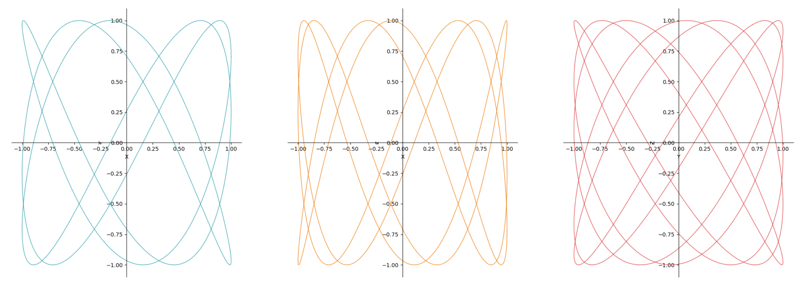
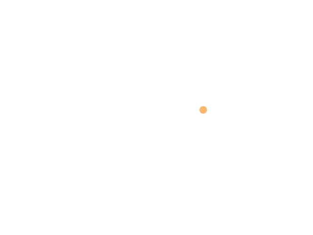
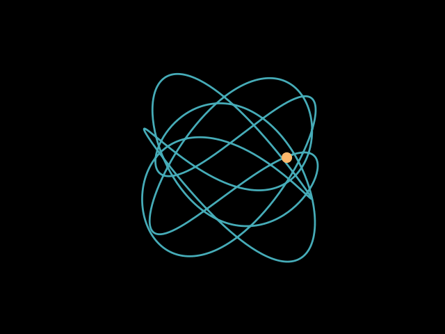

---

$\newcommand{\dd}{\mathrm{d}}$

A Fourier knot is a mathematical knot whose coordinates can be expressed as a
finite Fourier series. A particular subset of the Fourier knots are the
[Lissajous knots](https://mathworld.wolfram.com/LissajousCurve.html). They're
the simplest form of Fourier knots as the Fourier series for each coordinate is
given by a single cosine term:

$$x(t) = \cos(n_x t + \phi_x)$$
$$y(t) = \cos(n_y t + \phi_y)$$
$$z(t) = \cos(n_z t + \phi_z)$$

where $n_x$, $n_y$, and $n_z$ are integers that determine the number of
oscillations in each coordinate, and $\phi_x$, $\phi_y$, and $\phi_z$ are phase
shifts, which determine the starting position and orientation of the knot. A
common example of integer frequencies and phase shifts are $n_x=3$, $n_y=5$,
$n_z=7$ and $\phi_x=0$, $\phi_y=\pi/4$, $\phi_z=\pi/12$.

A characteristic of the Lissajous knot is that its projection onto any of the
three coordinate planes is a Lissajous curve:




Though animating this in 3D isn't much different to the example outlined in the
[quickstart
guide](https://github.com/aymenhafeez/animplotlib?tab=readme-ov-file#basic-3d-animation-example),
we can use it to see how normal matplotlib functions can be used on top of the
animplotlib class to customise the plot.

We can import the necessary libraries as normal and define the Lissajous knot
to generate the data being plotted:

```python
import numpy as np
import matplotlib.pyplot as plt
import animplotlib as anim

# defining the Lissajous knot
n = 1000
t = np.linspace(0, 2*np.pi, n)
x = np.cos(3*t)
y = np.cos(5*t + np.pi/4)
z = np.cos(7*t + np.pi/12)
```

Note that the time parameter `t` is defined over the interval $[0, 2\pi]$ i.e.
one full oscillation, after which the animation resets and loops.



Though the rotation and the loop line up, having the animation loop completely
seamlessly would be nice. We could increase the interval by multiples of $2\pi$
to make the loop longer, however this would still result in the animation
eventually looping in the same way as above. To create a seamless loop we can
make a static plot of the curve and have the `point` animate over it, and make
the `line` invisible:

```python
fig = plt.figure()
ax = fig.add_subplot(111, projection='3d')

# static Lissajous knot
ax.plot(x, y, z, lw=1)
# setting lw=0 to make the line invisible
line, = ax.plot([], [], [], lw=0)
point, = ax.plot([], [], [], 'o', markersize=10)
ax.set_xlim(np.min(x), np.max(x))
ax.set_ylim(np.min(y), np.max(y))
ax.set_zlim(np.min(z), np.max(z))
ax.set_axis_off()

# NOTE: rotation_speed=0.36 gives one full rotation every 1000 frames
# this ensures the rotation loops seamlessly with the animation
anim.AnimPlot3D(fig, ax, line, point, x, y, z, plot_speed=3,
                rotation_speed=0.36)
```


