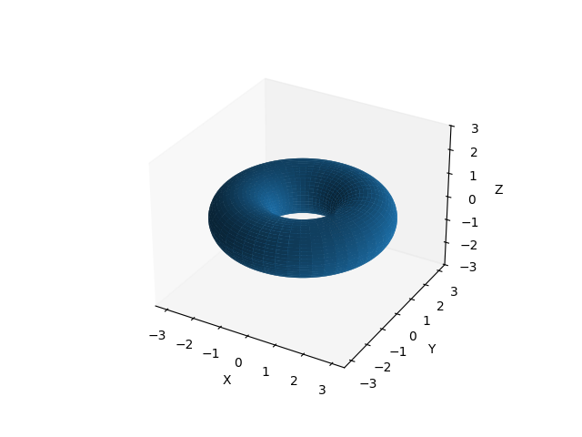
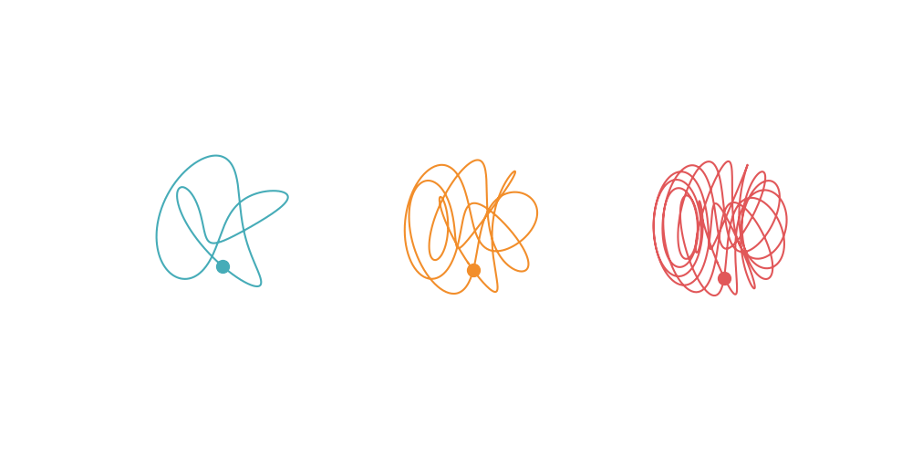

---
$\newcommand{\dd}{\mathrm{d}}$

Torus knots are a class of knots that lie on and wrap around the surface of a
torus.

<center>
  <figure> 
     
  </figure>
</center>

<!--  -->

Because they produce a cool looking plot we'll use the torus knot as an example
of to use animlotlib to plot multiple 3D animations on a single figure.

Torus knots are defined parametrically by the following set of equations:

$$x(t) = (R + \cos(pt))(\cos(qt))$$

$$y(t) = (R + \cos(pt))(\sin(qt)) $$

$$z(t) = -\sin(pt)$$

where $R$ is the radius of the torus and $p$ and $q$ are integers which must be
coprime. This is important as it allows the torus to form a single, continuous
loop. A common configuration to view the torus knot is with $R = 2$. For the
parameters $p$ and $q$ we'll use three different pairs: $(3, 2)$, $(7, 3)$ and
$(15, 4)$ and see how the shape of the knot changes.

We can start with importing the necessary libraries, defining the knot and
values for $p$ and $q$. We'll allow $t$ to run over a period of $0$ to $2\pi$
(i.e. one whole revolution).

```python
import numpy as np
import matplotlib.pyplot as plt
import animplotlib as anim

n = 1000
t = np.linspace(0, 2 * np.pi, n)

parameters = [(3, 2), (7, 3), (15, 4)]
colors = ['#46ACB8', '#F28E2B', '#E15759']


def torus(p, q):
    x = (2 + np.cos(p * t)) * (np.cos(q * t))
    y = (2 + np.cos(p * t)) * (np.sin(q * t))
    z = -np.sin(p * t)
    return x, y, z
```

We can create a figure as well as some empty lists to store the axes, lines,
points and the data we'll be plotting. 

```python
fig = plt.figure(figsize=(10, 5))
axes = []
lines = []
points = []
xs, ys, zs = [], [], []
```

Next, we call the $\texttt{torus}$ function for each  set of parameters we
defined earlier. We can then create a line, point and static plot and append
each of these to corresponding lists created above.

```python
for parameter, color in zip(parameters, colors):
    p, q = parameter
    x, y, z = torus(p, q)
    xs.append(x)
    ys.append(y)
    zs.append(z)

    ax = fig.add_subplot(1, 3, len(axes) + 1, projection='3d')
    axes.append(ax)
    ax.plot(x, y, z, c=color)
    line, = ax.plot([], [], [], lw=0)
    point, = ax.plot([], [], [], 'o', color=color, markersize=10)
    lines.append(line)
    points.append(point)

    ax.set_xlim(np.min(x), np.max(x))
    ax.set_ylim(np.min(y), np.max(y))
    ax.set_zlim(np.min(z), np.max(z))
    ax.set_axis_off()

# Calling the AnimPlot3D class
anim.AnimPlot3D(fig, axes, lines, points, xs, ys, zs, plot_speed=2,
                rotation_speed=0.36)
```



<br>

<a href="https://aymenhafeez.github.io/animplotlib/">Back to examples</a>
