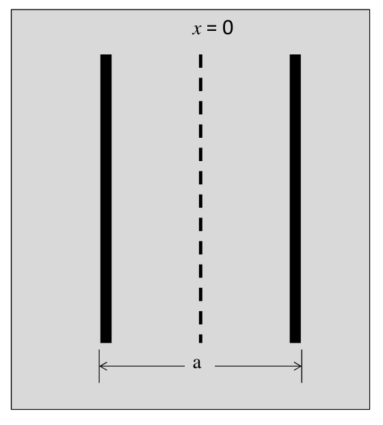
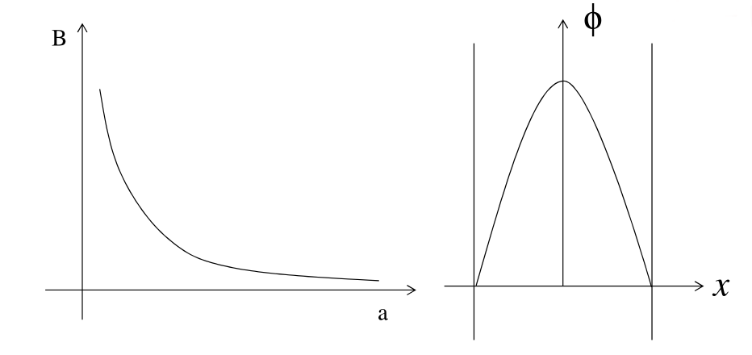

Deriving an expression for the thermal neutron flux in an infinite slab reactor

---

$\newcommand{\dd}{\mathrm{d}}$

In [this](https://aymenhafeez.github.io/bessel-function/) post we showed how to
derive the Helmholtz equation

$$
\begin{equation*}
\begin{aligned}
  \nabla^2\phi + B^2\phi = 0
\end{aligned}
\end{equation*}
$$

We saw how this can be solved in 2-dimensions, however, in the simple case of a
slab reactor of width $a$ in the $x$ direction, and infinite in the $y$ and $z$
directions the Helmholtz equation reduces to 1-dimension:

$$
\begin{equation*}
\begin{aligned}
  \frac{\dd^2 \phi}{\dd x^2} + B^2\phi = 0
\end{aligned}
\end{equation*}
$$

We can place the slab at $x = 0$ with its width in the interval
$\left[-\frac{a}{2}, \frac{a}{2}\right]$. We know that the flux must be
symmetric about $x = 0$, and that the flux must be 0 at the extrapolated
boundaries, $\pm\frac{a_{ex}}{2}$. The boundary conditions are then

$$
\begin{equation*}
\begin{aligned}
  \phi\left(\frac{a_{ex}}{2}\right) = \phi\left(-\frac{a_{ex}}{2}\right) = 0
\end{aligned}
\end{equation*}
$$

Furthermore, because of the symmetrical geometry there is no net flow of
neutrons at the center of the slab. Because the neutron current density is
proportional to the derivative of $\phi$, at the center of the slab i.e. at $x =
0$,

$$
\begin{equation*}
\begin{aligned}
  \frac{\dd \phi}{\dd x} = 0
\end{aligned}
\end{equation*}
$$

Again, because the geometry of the slab is symmetric around $x = 0$ this is
equivalent to the condition of $\phi$ being an even function

$$
\begin{equation*}
\begin{aligned}
  \phi(-x) = \phi(x)
\end{aligned}
\end{equation*}
$$

The 1-dimensional form of the flux equation has the general solution

$$
\begin{equation*}
\begin{aligned}
  \phi(x) = A\cos(Bx) + C\sin(Bx),
\end{aligned}
\end{equation*}
$$

where $A$ and $C$ are unknown constants. Taking the derivative and using the
condition that the derivative is 0 at $x = 0$ we get that $C = 0$. The flux
equation, therefore, becomes

$$
\begin{equation*}
\begin{aligned}
  \phi(x) = A\cos(Bx)
\end{aligned}
\end{equation*}
$$

Applying the boundary condition stated above that the flux at the extrapolated
boundaries is 0,

$$
\begin{equation*}
\begin{aligned}
  \phi\left(\frac{a_{ex}}{2}\right) = A\cos\left(\frac{Ba_{ex}}{2}\right) = 0,
\end{aligned}
\end{equation*}
$$

gives $A = 0$ with the trivial solution $\phi(x) = 0$, or that

$$
\begin{equation*}
\begin{aligned}
  \cos\left(\frac{Ba_{ex}}{2}\right) = 0
\end{aligned}
\end{equation*}
$$

This solution leads to $B$ taking values $B_n$,

$$
\begin{equation*}
\begin{aligned}
  B_n = \frac{n \pi}{a_{ex}},
\end{aligned}
\end{equation*}
$$

for odd values of $n$.  The square of the lowest value of $B$, i.e. $B_1^2$, is
the *buckling* of the reactor, which represents the fuel material in an infinite
medium.  Under non-critical conditions, the reactor flux is the sum of the
cosine functions for all values of $B_n$, i.e.

$$
\begin{equation*}
\begin{aligned}
  \phi(x) = \sum_{n \geq}^{} A\cos(B_n x) = \sum_{n \geq 0}^{}
  A\cos\left(\frac{n\pi x}{a_{ex}}\right)
\end{aligned}
\end{equation*}
$$

However, the only physically possible case is that of a critical reactor where
all the cosine functions except the first one die out in time. And so, the
flux in a critical slab reactor is given by

$$
\begin{equation*}
\begin{aligned}
  \phi(x) = A\cos(B_1 x) = A\cos\left(\frac{\pi x}{a_{ex}}\right)
\end{aligned}
\end{equation*}
$$

Note that the value of the constant $A$, which determines the magnitude of the
flux, has not been determined. Because the Helmholtz equation we started with is
homogeneous, multiplying the flux by any constant still gives a valid solution.
Furthermore, the magnitude of the flux in the reactor is determined by the
reactor power rather than its material properties. The recoverable energy per
fission in a nuclear reactor, $E_f$, is $~200 \text{ MeV} = 3.2 \times 10^{-11}
\text{ J}$. There are, therefore, $\Sigma_f \phi(x)$ fissions per cm$^3$s$^{-1}$
at the point $x$, where $\Sigma_f$ is the macroscopic cross section. And so, the
power, $P$ (watts/cm$^2$), is

$$
\begin{equation*}
\begin{aligned}
  P = E_f\Sigma_f \int_{-\frac{a}{2}}^{\frac{a}{2}} \phi(x) \dd x
\end{aligned}
\end{equation*}
$$

Substituting in and integrating the expression we found for the reactor flux we get

$$
\begin{equation*}
\begin{aligned}
  P = \frac{2a_{ex}E_f\Sigma_fA\sin\left(\frac{\pi a}{2a_{ex}}\right)}{\pi}
\end{aligned}
\end{equation*}
$$

Rearranging this we get the constant $A$ as

$$
\begin{equation*}
\begin{aligned}
  A = \frac{\pi P}{2aE_f\Sigma_f\sin\left(\frac{\pi a}{2a_{ex}}\right)}
\end{aligned}
\end{equation*}
$$

And so, the thermal flux in a slab reactor can be expressed as

$$
\begin{equation*}
\begin{aligned}
  \phi(x) = \frac{\pi P}{2a_{ex}E_f\Sigma_f\sin\left(\frac{\pi
  a}{2a_{ex}}\right)}\cos\left(\frac{\pi x}{a_{ex}}\right)
\end{aligned}
\end{equation*}
$$

<!-- 
 -->
<!--  -->
<!-- 
 -->

###  References:
Lamarsh, A. J. Baratta, Introduction to Nuclear Engineering, 3d ed.,
Prentice-Hall, 2001, ISBN: 0-201-82498-1.
