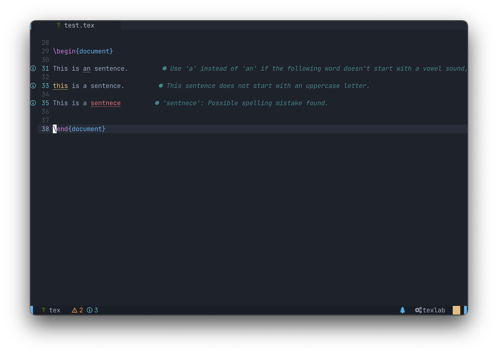

Setting up grammar checking with Neovim's native LSP client and grammar-guard

---

I use Neovim these days primarily for writing in LaTeX, as well as some light
Python development for hobby projects. The core of my LaTeX workflow is made up
of using [Ultisnips](http://github.com/SirVer/ultisnips) as my snippet engine
and a couple of [janky
mappings](https://github.com/aymenhafeez/dotfiles/blob/master/nvim/after/ftplugin/tex.lua)
to compile and show a PDF preview.

<!-- <p align="center" style="fancy-image"> -->
<!--    -->
<!-- </p> -->

{: .fancy-image }

Combined with Neovim's native LSP and
[nvim-cmp](http://github.com/hrsh7th/nvim-cmp) for completion suggestions, this
creates a fast and seamless writing environment. Though Neovim has
a built-in spell checker, one thing I was missing was some sort of system to
check grammar while writing. This doesn't seem essential but a quick way of
checking for grammatical errors can be useful, particularly when writing
important documents or reports. After some research I came across a plug-in
called [grammar-guard](http://github.com/brymer-meneses/grammar-guard.nvim),
which uses the [ltex](http://github.com/valentjn/ltex-ls) language server to
carry out grammar checks and give suggestions. This was exactly what I was
looking for.

Getting it setup is relatively straightforward, as described by the
documentation. The plug-in itself can be installed with whatever package manager
you use, for example with packer.nvim,

```lua
use {
  "brymer-meneses/grammar-guard.nvim",
  requires = {
    "neovim/nvim-lspconfig",
    "williamboman/nvim-lsp-installer"
  }
}
```

nvim-lspconfig provides configurations for Neovim's LSP client and
nvim-lsp-installer allows you to easily manage LSP servers. Once these are
installed we can run `:LspInstall ltex` to install the ltex language server.

After that, we need to configure grammar-guard to enable it with the LSP. First,
we need to initialise grammar-guard:

```lua
require("grammar-guard").init()
```

We can then configure grammar-guard itself with lsp-config, for example:

```lua
require("lspconfig").grammar_guard.setup({
  on_attach = on_attach,
  capabilities = capabilities,
  cmd = { "/usr/local/bin/ltex-ls" },
  settings = {
    ltex = {
      enabled = { "latex", "tex", "bib", "markdown" },
      language = "en-GB",
      diagnosticSeverity = "info",
      checkFrequency="save",
      setenceCacheSize = 2000,
      additionalRules = {
        enablePickyRules = false,
      },
      trace = { server = "verbose" },
      dictionary = {},
      disabledRules = {},
      hiddenFalsePositives = {},
    },
  },
})
```

Now, opening up a tex or markdown file, grammar-guard should be up and running.
We can run `:LspInfo` to see what langage servers are attached to the current
buffer, and we should see that grammar-guard is one of them.

<p align="center">
  
</p>
