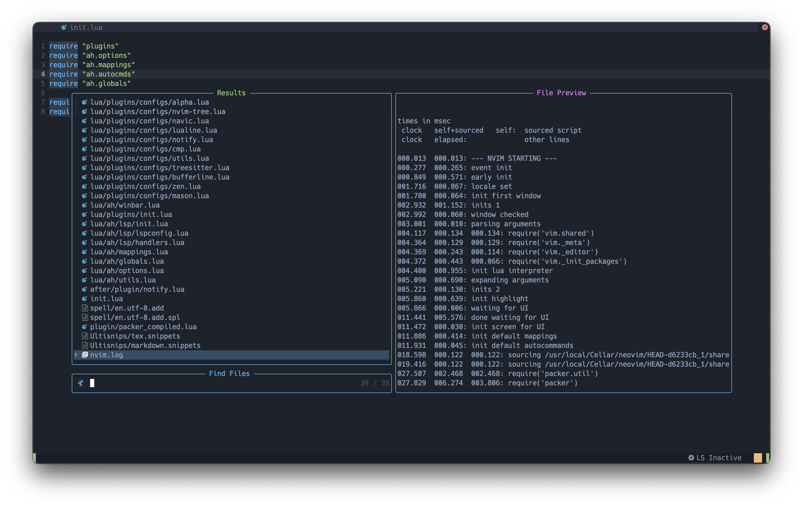
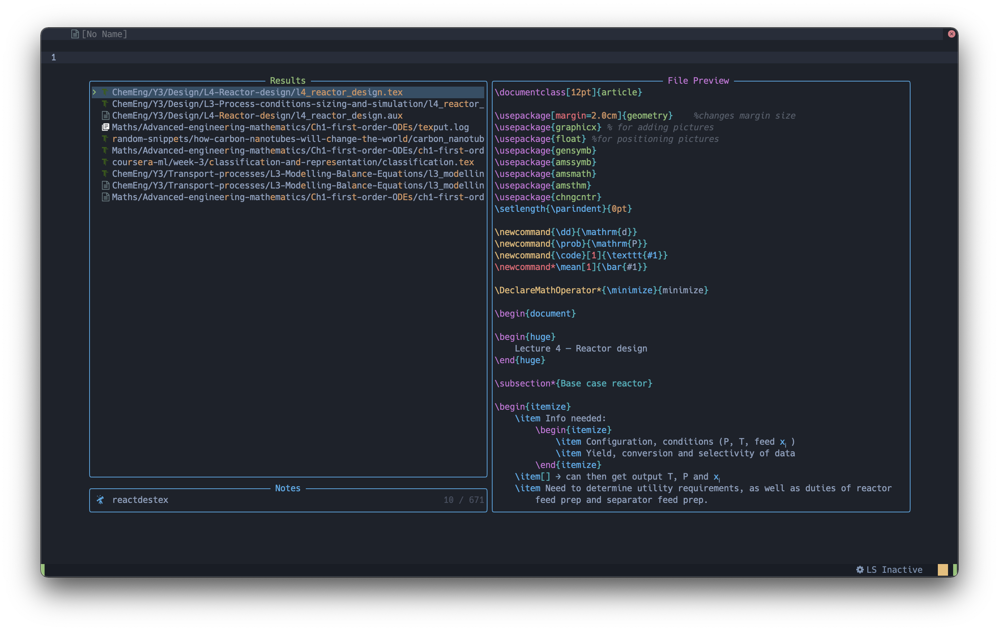
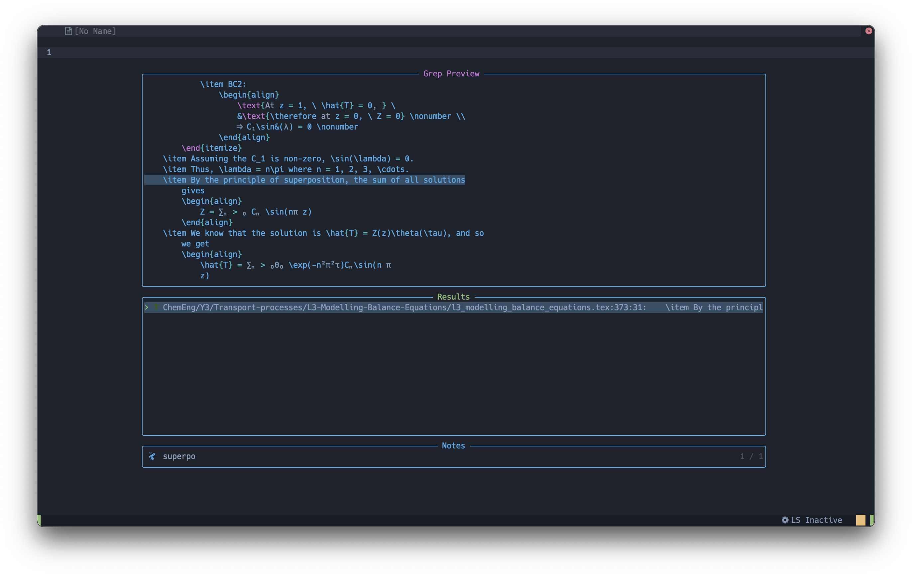
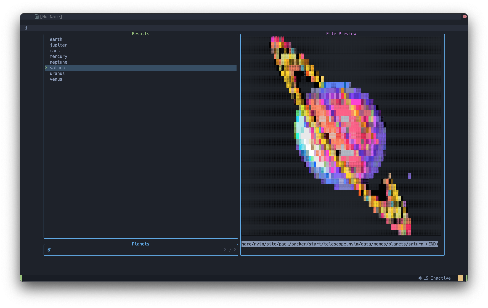

Talking about one of my favourtite Neovim plugins

---

Though I do use a fair few ([a
lot](https://github.com/aymenhafeez/dotfiles/blob/master/nvim/lua/plugins/init.lua))
plugins, I like to use (Neo)vim's built-in features wherever possible (with some
exceptions). And when it comes to file-navigation Vim does have some pretty good
options. There's a built-in hierarchical file-explorer called Netrw, as well as
the [`:edit`](https://neovim.io/doc/user/editing.html#:edit) and
[`:find`](https://neovim.io/doc/user/editing.html#:find) commands. When combined
with setting the [`'path'`](https://neovim.io/doc/user/options.html#'path')
option to be optimised with the context of the directory structure you're
working in, these can provide a fuzzy-finder like experience, particularly with
[`wildmenu`](https://neovim.io/doc/user/options.html#'wildmenu') set for
command-line completion. This was the setup I worked with for a long time, and
I was mainly happy with it. The main issue I had was that `wildmenu` would only
complete exact matches for substrings when searching/navigating for something.
For example, when wanting to quickly check the help docs for something, unless
I knew the exact help-tag I wanted to search for, then there wasn't any quick
and easy way to get to the result I wanted, which would lead to having to
`:helpgrep` and filter thought the results. If only there was a tool which could
quickly filter and sort through any list given to it.

## "File gazing" in Lua

> telescope.nvim is a highly extendable fuzzy finder over lists. Built on the latest awesome features from neovim core. Telescope is centered around modularity, allowing for easy customization.

There are a lot of fuzzy finders available for (Neo)vim, such as
[ctrlp.vim](https://github.com/ctrlpvim/ctrlp.vim) and
[fzf.vim](https://github.com/junegunn/fzf.vim), and they're really good
projects, too. The main reason I prefer Telescope, however, is that it feels
like it could be a built-in Neovim feature. Let me explain.

Fzf.vim is an amazing fuzzy finder and I used it for a long time before
migrating to Neovim and Telescope. However, it isn't really a Vim plugin, as it
says itself in its README. It really just acts as a way of calling the fzf
command-line tool from within Vim. The difference with Telescope is that it's
essentially just running Lua functions _inside_ Neovim, and interacting with the
current buffer. To me, this just feels a lot more natural.

## Vast defaults

Telescope comes with a bunch of built-in "pickers" by default. They can be
accessed by running `:Telescope <builtin_picker>`. For example
`find_files` will list files in the current working directory, `oldfiles` will
list recently opened files, `live_grep` will give results for a string search as
you type etc. It even integrates with the native LSP with commands such
`lsp_references` for search for references of the word under the cursor, as well
as `diagnostics` for diagnostic search. The whole list of built-in pickers can
be found [here](https://github.com/nvim-telescope/telescope.nvim#pickers).

## Extensibility

Telescope is hugely configurable, both visually and functionally. The defaults
can be configured similarly to any other plugin using the setup function. There
are two modes of configuring the default layout: `layout_strategy` and
`layout_config`, for example:

```lua
require("telescope").setup {
    defaults = {
        layout_strategy = "horizontal",
        layout_config = {
            height = 0.75,
            widht = 0.9
          }
      }
  }
```

<p align="center">
  
</p>

The above shows the default `horizontal` `layout_strategy`. See `:help
telescope.layout` for more detail on the various different layouts available.

The above `setup` function set global settings which are applied to all built-in
pickers. However, certain pickers are better suited to other layouts than the
default `horizontal` layout. Luckily, Telescope allows each picker to be called
with its own settings, and each layout can be configured individually with some
simple Lua functions. 

Just as an aside to make more sense of the next section, my Telescope
configuration has a dedicated folder `nvim/lua/ah/telescope`, with the following
structure. The plug-in is set up and required in `init.lua`, and various
functions are kept in `utils.lua` to be called from the `mappings.lua`.

```bash
telescope
├── init.lua
├── mappings.lua
└── utils.lua
```

One of the built-in pickers is `spell_suggest`, which, when called, gives
spelling suggestions for the word under the cursor. However, having the default
large display pop-up seems a bit excessive for spelling suggestions. Instead, we
can write a function to call the `spell_suggest` picker with specified settings:

```lua
local M = {}

local telescope = require("telescope.builtin")

function M.spell_check()
  telescope.spell_suggest(
    theme.get_cursor {
      prompt_title = "",
      layout_config = {
        height = 0.25,
        width = 0.25
      }
    })
end

return M
```

Here, we're calling the `spell_suggest` picker with the built-in `get_cursor`
theme, which provides a cursor relative list, which seems more appropriate for
this picker. After that we're just getting rid of the `prompt_title` by setting
it to an empty string, and then setting the size of the list in
`layout_strategy`. The function can then be called with a keymap, for example

```lua
vim.keymap.set("n", "<leader>ss", require("utils").spell_check, { noremap = true, silent = true })
```

{: .fancy-image }

By default, the `find_files` picker list files in the current working directory.
However, it can also be given a specific directory to list files from. The same
can be done with `live_grep` picker. I used to have the following line in my
`.vimrc`:

```viml
command! -nargs=1 Search vimgrep <args> ~/Dropbox/notes/MyNotes/**/*.{tex,md}
```

This created an Ex command, `Search`, which used `vimgrep` to search for
a string in my notes directory, and list all the files with the occurrence of
the string in a quickfix window. This was very handy when needing to quickly
look something up in my notes. The issue with this command, however, was that
when going through the quickfix list, each file would get opened in a new
buffer, and so after eventually finding the note I was looking for, the buffer
list would be full of random .tex files. We can mirror this functionality with
Telescope, but without having to open each file to check it:

```lua
function M.search_notes()
  telescope.find_files {
    cwd = "~/Dropbox/notes/MyNotes/",
    prompt_title = "Notes",
    layout_config = {
      height = 0.85
    }
  }
end

function M.grep_notes()
  telescope.live_grep {
    cwd = "~/Dropbox/notes/MyNotes/",
    prompt_title = "Notes",
    layout_strategy = "vertical",
    layout_config = {
      height = 0.85,
      width = 0.75
    }
  }
end
```

The first function is simply using the `find_files` picker, but being pointed to
a specific directory to list from.

<p align="center">
  
</p>

The second function more closely mirrors the Ex command I mentioned before,
using the `live_grep` picker. Having the preview while skimming through my notes
is super convenient

<p align="center">
  
</p>

And again, both of these functions are just called using a keymap:

```lua
vim.keymap.set("n", "<leader>sn", require("utils").search_notes, { noremap = true, silent = true }) 
vim.keymap.set("n", "<leader>gn", require("utils").grep_notes, { noremap = true, silent = true })
```

This post is a lot longer than I initially planned it to be, and I feel like
I've barely scratched the surface of what Telescope is capable of. Other than
the builtin pickers, there's also a wide range of extensions available. Check
out the telescope [topics page](https://github.com/topics/telescope) to see
what's available.

NOTE: `:help telescope.nvim` goes into A LOT of detail in terms of configuring
not only the layout, but also the sorting and previewing algorithms available.
I highly recommend reading through there.

I'll end by highlighting my favourite Telescope picker:
```lua
require("telescope.builtin").planets
```

<p align="center">
  
</p>
