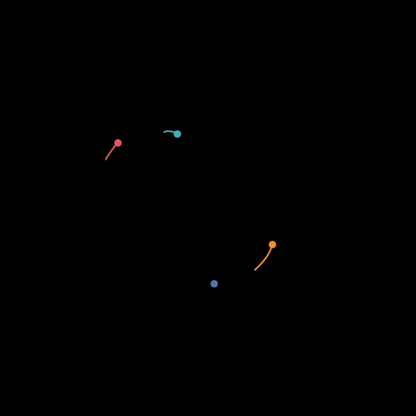

<!-- <center> -->
<!-- <figure>  -->
<!--     -->
<!-- </figure> -->
<!-- </center> -->

$\newcommand{\dd}{\mathrm{d}}$

The Lorenz system is a classic example of chaos in dynaimical systems. It's
known for its butterfly-shaped attractor and is defined by the following set of
ordinary differential equations:

$$\frac{\dd x}{\dd t}=\sigma(y-x)$$ 

$$\frac{\dd y}{\dd t}=x(\rho-z)-y$$ 

$$\frac{\dd z}{\dd t}=xy-\beta z$$

Because of its striking visual when plotted it'll serve as a good example to
show how the `animplotlib` package can be used for creating a more complex
animation in both 2D and 3D.

---

First ensure the `animplotlib` package is installed:

```bash
pip install animplotlib
```

We'll make use of `scipy.integrate.odeint` to solve the system to generate the
data being plotted. First we import the necessary libraries and define the
attractor:

```python
import numpy as np
from scipy.integrate import odeint
import matplotlib.pyplot as plt
from animplotlib import AnimPlot # AnimPlot class used for 2D animations

# parameters and initial conditions
sigma = 10
rho = 28
beta = 8/3
x0 = [0, 1, 15] # initial conditions
t = np.linspace(0, 100, 10000)

# defining the lorenz system
def lorenz(x_var, t):
    x, y, z = x_var
    dx_dt = sigma * (y - x)
    dy_dt = x * (rho - z) - y
    dz_dt = x * y - beta * z
    return [dx_dt, dy_dt, dz_dt]


# solving the system
x_solve = odeint(lorenz, x0, t)
x = x_solve[:, 0]
y = x_solve[:, 1]
z = x_solve[:, 2]
```

## 2D Animation

Let's visualize the Lorenz attractor in three 2D projections: `x vs y`, `x vs z`, and `y vs z`.

```python
fig, axs = plt.subplots(1, 3, figsize=(15, 5))

lines = []
points = []
xs = []
ys = []

# x vs y
line1, = axs[0].plot([], [], lw=0.5)
point1, = axs[0].plot([], [], 'ro', markersize=4)
axs[0].set_xlim(np.min(x), np.max(x))
axs[0].set_ylim(np.min(y), np.max(y))
axs[0].set_title('x vs y')
axs[0].set_axis_off()
lines.append(line1)
points.append(point1)
xs.append(x)
ys.append(y)

# x vs z
line2, = axs[1].plot([], [], lw=0.5)
point2, = axs[1].plot([], [], 'ro', markersize=4)
axs[1].set_xlim(np.min(x), np.max(x))
axs[1].set_ylim(np.min(z), np.max(z))
axs[1].set_title('x vs z')
axs[1].set_axis_off()
lines.append(line2)
points.append(point2)
xs.append(x)
ys.append(z)

# y vs z
line3, = axs[2].plot([], [], lw=0.5)
point3, = axs[2].plot([], [], 'ro', markersize=4)
axs[2].set_xlim(np.min(y), np.max(y))
axs[2].set_ylim(np.min(z), np.max(z))
axs[2].set_title('y vs z')
axs[2].set_axis_off()
lines.append(line3)
points.append(point3)
xs.append(y)
ys.append(z)

# Call the AnimPlot class
AnimPlot(fig, lines, points, xs, ys, plot_speed=2, l_num=1000)
```


## 3D Animation

To better see how these projections relate to each other we can create an
animation in 3D using the AnimPlot3D class. Using the same code as above to
solve the Lorenz system and generate the data:

```python
fig = plt.figure(figsize=(8, 6))
ax = fig.add_subplot(111, projection='3d') # for 3D plotting
line, = ax.plot([], [], [], lw=0.5)
point, = ax.plot([], [], [], 'ro', markersize=4)
ax.set_xlim(np.min(x), np.max(x))
ax.set_ylim(np.min(y), np.max(y))
ax.set_zlim(np.min(z), np.max(z))
ax.set_title('3D Lorenz Attractor')
ax.set_axis_off()

anim.AnimPlot3D(fig, ax, line, point, x, y, z, plot_speed=2,
                rotation_speed=0.25, l_num=1000, blit=False)
```

A standout property of chaotic systems is that they are very sensitive to
change in their input parameters. We can visualise this by plotting the Lorenz
attractor with various initial conditions on the same axes:

```python
import numpy as np
import matplotlib.pyplot as plt
from scipy.integrate import odeint
from animplotlib import AnimPlot3D

def lorenz_deriv(state, t, sigma=10, rho=28, beta=8/3):
    x, y, z = state
    dxdt = sigma * (y - x)
    dydt = x * (rho - z) - y
    dzdt = x * y - beta * z
    return [dxdt, dydt, dzdt]

def lorenz_trajectory(x0, y0, z0, t_step=5000, dt=0.01):
    t = np.linspace(0, t_step*dt, t_step)
    initial_state = [x0, y0, z0]
    states = odeint(lorenz_deriv, initial_state, t)
    xs, ys, zs = states[:,0], states[:,1], states[:,2]
    return xs, ys, zs

# Varying initial conditions
initial_conditions = [
    (0., 1., 1.05),
    (15., 10., 20.),
    (-15., -10., 30.),
    (5., -20., 40.)
]
# Colour values for each plot
colors = [
    "#4E79A7",
    "#F28E2B",
    "#76B7B2",
    "#E15759"
]

fig = plt.figure(figsize=(8, 8))
ax = fig.add_subplot(111, projection='3d')
ax.set_axis_off()

lines = []
points = []
xs, ys, zs = [], [], []

for ic, color in zip(initial_conditions, colors):
    x, y, z = lorenz_trajectory(*ic)
    xs.append(x)
    ys.append(y)
    zs.append(z)
    line, = ax.plot([], [], [], lw=2, color=color)
    point, = ax.plot([], [], [], 'o', color=color, markersize=8)
    lines.append(line)
    points.append(point)

ax.set_xlim(np.min(xs), np.max(xs))
ax.set_ylim(np.min(ys), np.max(ys))
ax.set_zlim(np.min(zs), np.max(zs))

AnimPlot3D(fig, [ax] * len(lines), lines, points, xs, ys, zs, plot_speed=2,
           rotation_speed=0.25, l_num=100, p_num=1)
```



